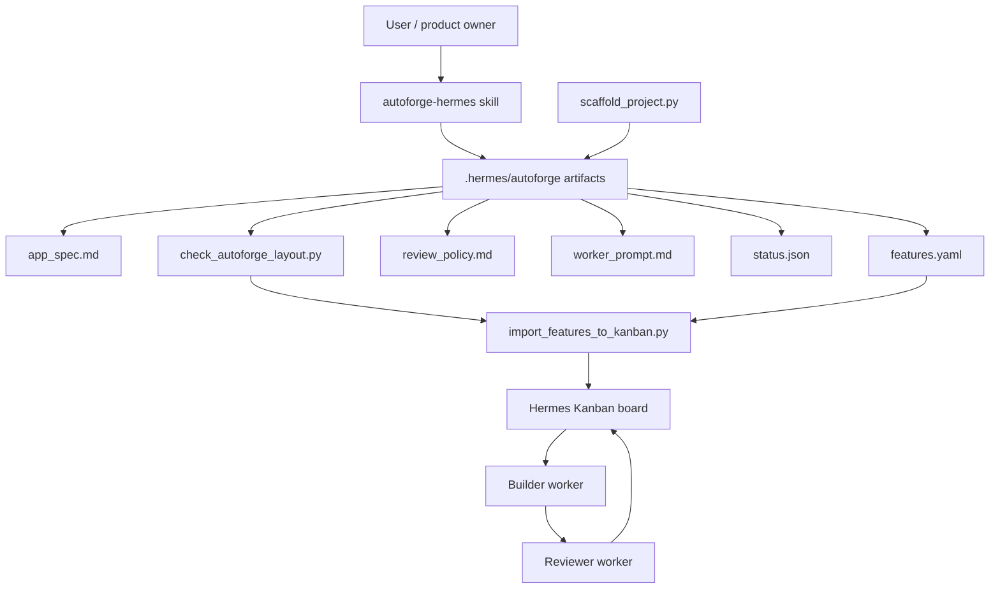
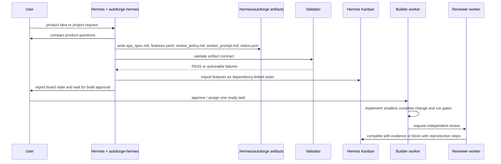

# AutoForge → Hermes Architecture Map

This document records how the public `AutoForgeAI/autoforge` architecture maps to a Hermes-native workflow. The repository is not a fork of AutoForgeAI/autoforge and does not copy Claude Agent SDK implementation code.

## System view



## Workflow sequence



## Element responsibilities

| Element | Responsibility |
|---|---|
| `autoforge-hermes` skill | Keeps Hermes in spec-first mode and prevents implementation before approval. |
| `app_spec.md` | Product source of truth: goal, users, journeys, screens, data, privacy, integrations, design, non-goals, success criteria. |
| `features.yaml` | Machine-readable feature graph with dependencies, acceptance criteria, and verification steps. |
| `review_policy.md` | Completion gates for build, tests, browser/API checks, persistence, security, and evidence. |
| `worker_prompt.md` | Behavioral contract for bounded builder/reviewer workers. |
| `status.json` | Spec-phase completion marker and artifact inventory. |
| `scaffold_project.py` | Creates the minimal valid artifact set for a new target project. |
| `check_autoforge_layout.py` | Validates the artifact contract before import or implementation. |
| `import_features_to_kanban.py` | Bridges `features.yaml` into Hermes Kanban tasks and dependency links. |
| Hermes Kanban | Durable execution queue for ready, blocked, completed, and regression tasks. |
| Builder worker | Implements one ready feature at a time and records verification evidence. |
| Reviewer worker | Independently checks completed work and passes or blocks with concrete evidence. |

## Core pattern

```text
idea → spec → initializer → feature database → coding sessions → testing/review → repeat
```

Hermes provides matching primitives: skills, project context, profiles, spawned agents, Kanban, browser/file/terminal tools, code-review skills, cron, and durable session search.

## Correspondence table

| AutoForgeAI/autoforge concept | Original role | Hermes equivalent | Adaptation note |
|---|---|---|---|
| Claude Code CLI | Runs the coding agent process. | `hermes chat`, Hermes Desktop, spawned Hermes worker profiles. | Use Hermes as the acting agent runtime instead of Claude Code. |
| Claude Agent SDK | Long-running agent loop and tool calls. | Hermes agent runtime, toolsets, profiles. | Hermes supplies model/provider routing, tools, memory, and session state. |
| `/create-spec` command | Interviews user and creates the application spec. | Hermes skill `autoforge-hermes`. | The skill asks product-level questions and writes spec artifacts. |
| `.autoforge/prompts/app_spec.txt` | Canonical project specification. | `.hermes/autoforge/app_spec.md`. | Keep source-first product goals, stack, data model, API/UI, and success criteria. |
| `.autoforge/prompts/initializer_prompt.md` | First-session prompt that turns spec into features. | Hermes initializer prompt / one-shot `hermes chat -q`. | Reads spec and creates Kanban tasks with dependencies. |
| `.spec_status.json` | Signals that spec generation is complete for the UI. | `.hermes/autoforge/status.json`. | Completion marker for automation and validation. |
| `features.db` | SQLite feature/test database. | Hermes Kanban board SQLite. | Store implementation, review, regression, and blocked tasks as Kanban items. |
| `feature_create_bulk` | Creates feature test cases. | `scripts/import_features_to_kanban.py` + `hermes kanban create`. | Generate tasks from `features.yaml`; preserve dependencies and priorities. |
| `feature_get_next` | Selects next pending feature. | Kanban dispatcher / ready task list. | Let dispatcher or operator assign ready tasks to workers. |
| `feature_mark_in_progress` | Claims feature for a coding session. | Kanban task assignment / worker claim. | Worker owns one task or a small independent batch. |
| `feature_mark_passing` | Marks feature complete after verification. | `hermes kanban complete`. | Complete only after lint/build/tests/browser/API evidence. |
| `feature_mark_failing` | Reopens a regression. | `hermes kanban block` or linked regression task. | Preserve failure evidence and reproduction steps. |
| `feature_skip` | Moves blocked feature out of the way. | `hermes kanban block`. | Do not silently skip; record the external dependency or missing auth. |
| Initializer Agent | First run creates feature DB, structure, git. | Hermes initializer profile / one-shot worker. | Creates project skeleton, `.hermes/autoforge/*`, Kanban board. |
| Coding Agent | Implements one feature per session. | Hermes builder worker/profile. | Uses file/terminal/browser tools; one feature at a time. |
| Testing Agent | Regression-tests passing features. | Hermes tester/reviewer worker. | Runs UI/API checks, restart persistence tests, and marks failures. |
| Code review subagent | Reviews code quality/security. | Hermes review skills. | Review before merge/release and after risky feature batches. |
| Browser verification | Proves UI feature works. | Hermes browser/computer-use tools. | Required for UI features. |
| Mock-data grep | Detects fake/in-memory implementations. | Terminal/search quality gate. | Search for mock/fake/sample/devStore/globalThis/TODO database patterns. |
| Server restart persistence test | Catches in-memory stores. | Hermes terminal process + browser/API recheck. | Create unique data, restart server, verify persistence. |
| Git commits after features | Durable progress checkpoint. | Git commit per verified feature/batch. | Commit only after verification; include task ID. |
| Web UI progress/Kanban | Monitors feature progress. | Hermes Desktop + Kanban dashboard/status. | Hermes already has project/session UI and Kanban status. |
| Auto-continue between sessions | Keeps building across context windows. | Hermes Kanban dispatcher, cron jobs, spawned workers. | Use bounded workers, not uncontrolled infinite loops. |

## Proposed Hermes workflow

### 1. Spec phase

A Hermes skill interviews the user and writes:

```text
.hermes/autoforge/app_spec.md
.hermes/autoforge/features.yaml
.hermes/autoforge/review_policy.md
.hermes/autoforge/worker_prompt.md
.hermes/autoforge/status.json
```

The spec phase asks product questions first, derives technical defaults when appropriate, and avoids implementation until the spec is approved.

### 2. Initialization phase

The initializer reads the spec and creates a Kanban board with:

```text
Infrastructure tasks
Core feature tasks
UI/browser verification tasks
Security/access-control tasks
Regression tasks
Review/release tasks
```

Every functional task carries acceptance criteria and verification steps.

### 3. Build phase

Builder workers take one ready task at a time:

```text
kanban_show → implement → lint/typecheck/build/test → browser/API verification → commit → kanban_complete
```

If blocked, they write the blocker and stop instead of pretending success.

### 4. Review phase

Reviewer/tester workers independently check completed work:

```text
read diff → run quality gates → browser regression → persistence restart → security checks → approve or reopen
```

The reviewer creates linked regression tasks when it finds failures.

### 5. Release / improve phase

After all required tasks pass, Hermes can run a final release review and optionally create one small improvement task at a time.

## Minimal quality gates

A Hermes AutoForge-style feature is not complete until all applicable gates pass:

- lint / format / typecheck;
- build succeeds;
- unit/integration tests pass;
- UI feature verified in browser;
- no obvious mock/in-memory data patterns in production code;
- data persists after server restart for CRUD/data features;
- security/access rules are checked for protected routes/API endpoints;
- git diff is reviewed;
- Kanban task is completed with evidence.
