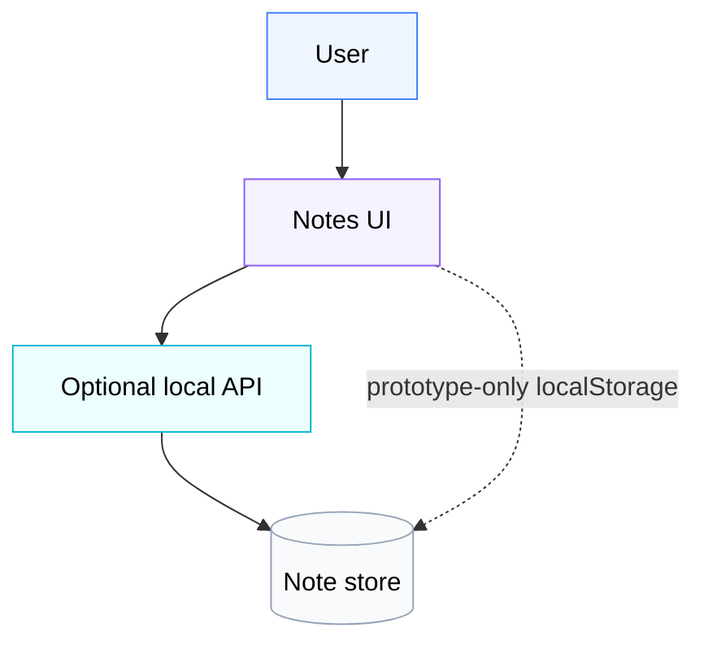
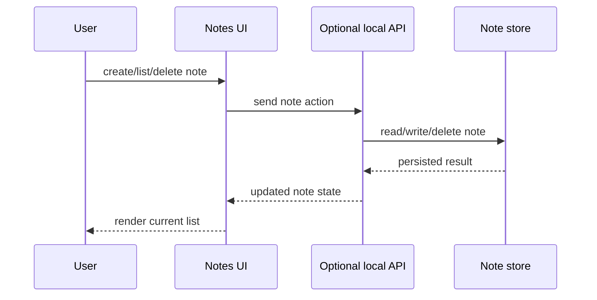

# Tiny Notes system view

## System boundary

Tiny Notes is a local smoke project for the AutoForge → Hermes workflow. The project boundary includes the note UI, optional local API, and persistent note storage used by a full implementation. External deployment, authentication, and third-party services are outside this sample.

## Main elements

| Element | Role | Owns data? | Notes |
|---|---|---:|---|
| User | Creates, views, and deletes notes. | no | Human actor for the smoke flow. |
| Notes UI | Presents create/list/delete actions. | no | May be plain HTML/JavaScript or a small frontend framework. |
| Local API | Handles note CRUD in a full implementation. | no | Optional for a static/localStorage smoke implementation. |
| Note store | Persists note records. | yes | Must survive refresh/restart for a full implementation. |

## Component diagram

## Data flow

## Integration points

- Auth: out of scope.
- Payments: none.
- Email: none.
- Storage: local persistent note store.
- LLM/API: none.
- Analytics: none.

## Architectural constraints

- Persistence: full implementation must survive refresh/restart.
- Privacy: local test notes only.
- Security: no protected routes in this smoke sample.
- Deployment: local development only.
- Performance: small data volume.
- Offline/real-time: out of scope.

## Diagram standards

- Use `flowchart TD` or `flowchart LR` for component diagrams.
- Use `-->` for main flows and `-. label .->` for dependencies; never use `==>`.
- Use light pastel `classDef` fills with colored strokes and black text.
- Use Mermaid subgraphs only for real bounded subsystems; keep nesting shallow.
- If emoji are used in Mermaid labels, prefer HTML entities instead of raw Unicode emoji.
